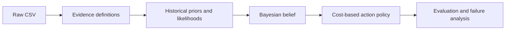

# Credit Card Fraud Decision Agent — Project Tracking

## Current status

- **Current stage:** Stage 5 complete; awaiting review
- **Next stage:** Stage 6 — evaluation
- **Required blocker:** None; `data/credit_card_fraud_10k.csv` is present
- **Implementation started:** Stages 1–5
- **Stage commits created:** Stage 1 — `85b4195`; Stage 2 — `92a4098`; Stage 3 — `a89f8a4`; Stage 4 — `8cdfaf8`; Stage 5 — `f5c8be0`
- **Raw dataset modified:** No
- **Last updated:** 2026-09-05

## Project objective

Build a beginner-friendly agent that observes transaction evidence and chooses among:

- `APPROVE`
- `GET_MORE_EVIDENCE`
- `BLOCK`
- `HUMAN_REVIEW`

The true state is hidden during decision-making and is only revealed afterward for evaluation.
The Week 1 implementation will use historical probabilities, sequential Bayesian updating, and a deterministic expected-cost policy.

## Scope guardrails

- Use Python, pandas, math, and a readable Jupyter Notebook.
- Do not use machine-learning classifiers, neural networks, Random Forest, XGBoost, entropy, or Expected Information Gain.
- Do not modify the original CSV.
- Calculate priors and likelihoods from the CSV; never paste expected values as if they were calculated.
- Label every value as either **DATASET-DERIVED** or **DESIGN ASSUMPTION**.
- Work one stage at a time and stop after each stage.
- Before each stage commit: show changed files, explain the commit, and verify the diff.

## Planned repository structure

```text
Credit-Card-Fraud-Agent/
├── data/
│   └── credit_card_fraud_10k.csv
├── decisions/
│   └── probability-decision-record.md
├── experiments/
│   └── agent_simulation.ipynb
├── discussion-record.md
├── project-tracking.md
└── research-file.md
```

No `paper/`, `social/`, `src/`, or `results/` directories will be created for Week 1.

## Stage plan and freeze boundaries

## Visual project map



Plain-text version:

```text
Raw CSV -> Evidence -> Historical probabilities -> Belief -> Action -> Evaluation
```

At every arrow, the project should preserve enough intermediate values for a beginner to trace one transaction by hand.

### Stage 2 probability map

```text
9,849 LEGITIMATE rows ──> P(LEGITIMATE) = 9,849 / 10,000 = 0.984900
  151 FRAUDULENT rows ──> P(FRAUDULENT) =   151 / 10,000 = 0.015100

Evidence count inside each state ──> likelihood P(evidence | state)
```

### Stage 3 belief map

```text
Prior belief
    ↓ EARLY_HOUR=True
Posterior: LEGITIMATE 0.949491, FRAUDULENT 0.050509
    ↓ FOREIGN_TRANSACTION=False
Posterior: LEGITIMATE 0.973956, FRAUDULENT 0.026044
```

### Stage 4 policy map

```text
Posterior: LEGITIMATE 0.973956, FRAUDULENT 0.026044
       |
       +--> EC(APPROVE) = 0.260444
       +--> EC(BLOCK)   = 5.843734
       |
       +--> lower cost: APPROVE
```

### Stage 5 agent-loop map

```text
Transaction with hidden label
          |
          v
EARLY_HOUR -> FOREIGN_TRANSACTION
          |
          v
Update belief -> calculate costs -> policy action
                              |
             +----------------+----------------+
             |                |                |
          APPROVE/BLOCK   GET_MORE_EVIDENCE  HUMAN_REVIEW
             |                |                |
            stop       reveal next fixed item  stop
                              |
                              +--> repeat
```

### Stage 1 — Dataset inspection + project definition

**Outcome:** Confirmed the CSV schema, created the five binary evidence definitions in the notebook, and documented hidden states plus selected/excluded columns.

**Must calculate or verify:** row count, required columns, data types/basic validity, and derived evidence definitions.

**Commit:** `define credit card fraud states and evidence`

**Freeze boundary:** Do not calculate priors/likelihood tables or implement Bayesian updating until this stage is reviewed.

### Stage 2 — Priors + likelihoods

**Outcome:** Calculated class counts, priors, and all five conditional likelihood pairs directly from the CSV; verified each probability is in `[0, 1]` and each True/False pair sums to 1.

**Commit:** `derive fraud priors and evidence likelihoods`

**Freeze boundary:** Do not build the decision policy or evaluation until the probability table is traceable to dataset counts.

### Stage 3 — Bayesian belief simulation

**Outcome:** Extended the notebook with sequential updates for True and False evidence, explicit normalization, and a manually traceable two-observation example.

**Commit:** `build Bayesian credit card fraud belief simulation`

**Freeze boundary:** No action selection yet; this stage only establishes belief updates.

### Stage 4 — Decision costs + policy

**Outcome:** Added the APPROVE/BLOCK relative-cost matrix, expected costs, the documented uncertainty margin, GET_MORE_EVIDENCE, and HUMAN_REVIEW fallback.

**Commit:** `add credit card fraud decision policy`

**Freeze boundary:** The policy must be deterministic and must not use information-gain ranking.

### Stage 5 — Complete agent loop

**Outcome:** Added the complete sequential loop, initial evidence reveal, fixed additional-evidence order, hidden-label protection, and the supplied example transaction trace.

**Commit:** `add sequential fraud evidence and agent loop`

**Freeze boundary:** The hidden label remains unavailable until the action is complete.

### Stage 6 — Evaluation

**Outcome:** Evaluate 50 held-out labeled transactions using the baseline, Policy A, and Policy B; calculate confusion matrix, fraud precision/recall, false positives/negatives, human-review rate, and total decision cost.

**Commit:** `add fraud policy comparison and evaluation`

**Freeze boundary:** Labels are revealed only after each decision for scoring.

### Stage 7 — Failure analysis

**Outcome:** Inspect at least five actual incorrect decisions and document evidence, posterior, collected evidence, action, true state, error type, and evidence-based likely reason.

**Commit:** `document fraud agent failure analysis`

**Freeze boundary:** No fabricated explanations or human feedback.

### Stage 8 — Probability decision record

**Outcome:** Record one uncertain transaction from observation through posterior updates, evidence collection, final action, and post-decision evaluation label.

**Commit:** `add fraud probability decision record`

**Freeze boundary:** Dataset version and policy version must be recorded.

## Fixed V1 model decisions

These are intentional assumptions, not dataset-derived probabilities:

- `EARLY_HOUR = transaction_hour <= 5`
- `FOREIGN_TRANSACTION = foreign_transaction == 1`
- `LOCATION_MISMATCH = location_mismatch == 1`
- `LOW_DEVICE_TRUST = device_trust_score < 50`
- `HIGH_VELOCITY = velocity_last_24h >= 3`
- Initial evidence: `EARLY_HOUR`, then `FOREIGN_TRANSACTION`.
- Additional evidence order: `LOCATION_MISMATCH`, `LOW_DEVICE_TRUST`, `HIGH_VELOCITY`.
- Relative costs: APPROVE/LEGITIMATE = 0, APPROVE/FRAUDULENT = 10, BLOCK/LEGITIMATE = 6, BLOCK/FRAUDULENT = 0.
- The uncertainty margin will be selected and documented before the policy is implemented; it must not be presented as learned from the dataset.

## Required evidence trail

For each stage, the final response must include:

1. What was built and why.
2. Changed files.
3. Beginner-friendly code explanation.
4. Actual outputs and calculated values.
5. Dataset-derived values versus assumptions.
6. Manual verification instructions.
7. Git diff summary.
8. Commit created.
9. What the next stage will do.

The work pauses after each stage until the user says `CONTINUE`.

## Open items / pending human input

| Item | Status |
|---|---|
| Required CSV supplied at `data/credit_card_fraud_10k.csv` | Complete; verified with 10,000 rows and no missing values |
| User approval to begin Stage 1 after CSV is present | Pending |
| Reddit/community research links and human answers | Pending; do not fabricate |

## Next action

The required raw dataset is now present at:

`data/credit_card_fraud_10k.csv`

Begin Stage 1 only after explicit confirmation with `CONTINUE`.
