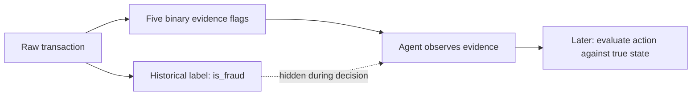
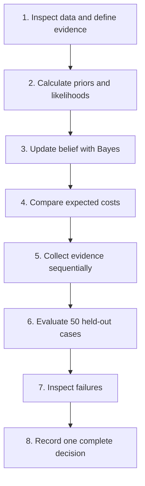

# Credit Card Fraud Decision Agent — Research File

## Stage 1: Problem definition

### Problem statement

The agent observes a credit-card transaction and must decide whether to `APPROVE`, `GET_MORE_EVIDENCE`, `BLOCK`, or send the case to `HUMAN_REVIEW` because the true fraud state is unknown during decision-making.

### Project objective

Build a beginner-friendly Week 1 agent using historical probabilities, sequential Bayesian belief updating, and deterministic cost-based decision logic. The agent must remain manually traceable for one transaction.

## Dataset choice

The raw dataset is `data/credit_card_fraud_10k.csv`. Stage 1 verification found 10,000 rows, all expected columns, and zero missing values. The original CSV is not modified.

## Hidden states

The hidden state is represented by the historical label:

| Historical label | Hidden state |
|---:|---|
| `is_fraud = 0` | `LEGITIMATE` |
| `is_fraud = 1` | `FRAUDULENT` |

The label will be hidden while the agent decides and revealed only afterward for evaluation.

### Visual: what the agent can see



Plain-text version:

```text
Raw transaction
      |
      v
Five evidence flags  --->  Agent makes a decision
                                  ^
                                  |
                    is_fraud stays hidden until evaluation
```

The important separation is that `is_fraud` helps us learn historical probabilities, but it is not available to the agent while it is deciding about a new transaction.

## Selected columns for V1

| Column | Use | Reason |
|---|---|---|
| `transaction_hour` | Selected evidence input | Used to derive `EARLY_HOUR`. |
| `foreign_transaction` | Selected evidence input | Direct geographic risk signal. |
| `location_mismatch` | Selected evidence input | Direct mismatch signal. |
| `device_trust_score` | Selected evidence input | Used to derive low device trust. |
| `velocity_last_24h` | Selected evidence input | Used to derive unusually high recent activity. |
| `is_fraud` | Historical target / hidden state | Used to calculate historical probabilities and evaluate decisions; not revealed during a live decision. |

## Excluded from V1 evidence

| Column | Reason for exclusion |
|---|---|
| `transaction_id` | Identifier only; it does not describe transaction risk. |
| `merchant_category` | Excluded to keep the first version small and manually traceable. |
| `cardholder_age` | Excluded from the initial evidence model to avoid unnecessary demographic complexity. |
| `amount` | Excluded from V1 so the first model focuses on the specified behavioral and location signals. |

## Feature-engineering rules

These rules are **DESIGN ASSUMPTIONS**. They create binary observations; they are not probabilities derived from the dataset.

| Evidence variable | Rule | Meaning |
|---|---|---|
| `EARLY_HOUR` | `transaction_hour <= 5` | The transaction occurred from midnight through 05:00. |
| `FOREIGN_TRANSACTION` | `foreign_transaction == 1` | The transaction is marked foreign. |
| `LOCATION_MISMATCH` | `location_mismatch == 1` | The transaction is marked as having a location mismatch. |
| `LOW_DEVICE_TRUST` | `device_trust_score < 50` | The device trust score is below 50. |
| `HIGH_VELOCITY` | `velocity_last_24h >= 3` | At least 3 recent transactions are recorded in the 24-hour velocity field. |

The exact boundary choices (`<= 5`, `< 50`, and `>= 3`) are V1 design choices. Stage 2 will calculate how often each resulting evidence variable occurs for each historical hidden state.

### Visual: raw columns becoming evidence

```text
transaction_hour       --(<= 5)-->  EARLY_HOUR
foreign_transaction    --(== 1)-->  FOREIGN_TRANSACTION
location_mismatch      --(== 1)-->  LOCATION_MISMATCH
device_trust_score     --(< 50)-->  LOW_DEVICE_TRUST
velocity_last_24h      --(>= 3)-->  HIGH_VELOCITY
```

The arrows above are feature-engineering rules. They do not say how likely fraud is. Stage 2 will estimate those probabilities from rows grouped by `is_fraud`.

### Visual: the Week 1 reasoning pipeline



Plain-text version:

```text
Inspect data
    -> Calculate historical probabilities
    -> Update belief
    -> Compare decision costs
    -> Get more evidence when needed
    -> Evaluate
    -> Analyze failures
    -> Record one complete decision
```

## Stage 1 verification output

The following was verified directly from the CSV:

```text
Rows: 10,000
Required columns present: yes
Missing values: 0
transaction_hour range: 0–23
foreign_transaction values: 0, 1
location_mismatch values: 0, 1
device_trust_score range: 25–99
velocity_last_24h range: 0–9
is_fraud values: 0, 1
```

Derived evidence counts in the 10,000-row dataset are included only as a Stage 1 sanity check, not as likelihoods:

```text
EARLY_HOUR: 2,455 true
FOREIGN_TRANSACTION: 978 true
LOCATION_MISMATCH: 857 true
LOW_DEVICE_TRUST: 3,359 true
HIGH_VELOCITY: 3,266 true
```

## Not implemented yet

- Class counts and priors
- Conditional likelihoods
- Complement likelihoods for false evidence
- Bayesian posterior updates
- Decision costs and uncertainty margin
- Agent action selection
- Held-out evaluation
- Failure analysis
- Reddit/community research

These will be added only in their assigned stages.
