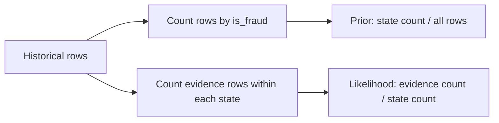
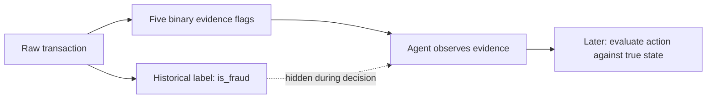
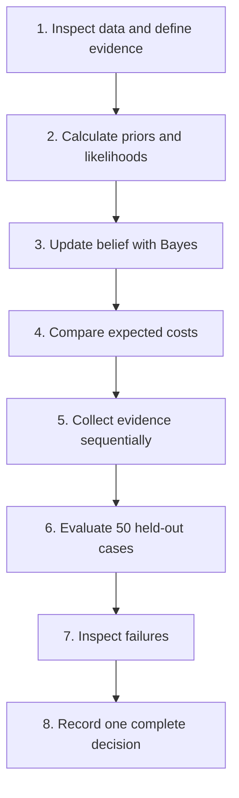
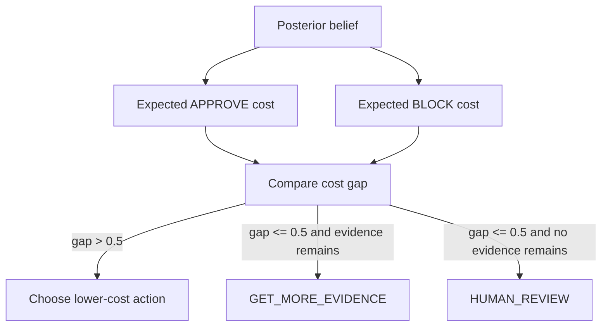

# Credit Card Fraud Decision Agent — Research File

## Stage 1: Problem definition

### Problem statement

The agent observes a credit-card transaction and must decide whether to `APPROVE`, `GET_MORE_EVIDENCE`, `BLOCK`, or send the case to `HUMAN_REVIEW` because the true fraud state is unknown during decision-making.

### Project objective

Build a beginner-friendly Week 1 agent using historical probabilities, sequential Bayesian belief updating, and deterministic cost-based decision logic. The agent must remain manually traceable for one transaction.

## Dataset choice

The raw dataset is `data/credit_card_fraud_10k.csv`. Stage 1 verification found 10,000 rows, all expected columns, and zero missing values. The original CSV is not modified.

## Stage 2: Historical priors and likelihoods

### Visual: where the probabilities come from



Plain-text version:

```text
All historical rows
      |
      +--> Count LEGITIMATE and FRAUDULENT -> priors
      |
      +--> Count evidence within each state -> likelihoods
```

### Class counts and priors

These are **DATASET-DERIVED**:

| Hidden state | Historical count | Calculation | Prior |
|---|---:|---|---:|
| `LEGITIMATE` | 9,849 | `9,849 / 10,000` | `0.984900` |
| `FRAUDULENT` | 151 | `151 / 10,000` | `0.015100` |
| **Total** | **10,000** | `9,849 + 151` | **1.000000** |

The prior is our starting belief before looking at transaction evidence. It reflects the class frequency in this historical dataset.

### Likelihoods

Each likelihood is calculated as:

```text
P(evidence=True | state)
    = number of rows where evidence is True and state matches
      / number of rows where state matches
```

The following values are **DATASET-DERIVED**:

| Evidence | State | True count | State count | `P(True \| State)` | `P(False \| State)` |
|---|---|---:|---:|---:|---:|
| `EARLY_HOUR` | `LEGITIMATE` | 2,331 | 9,849 | 0.236674 | 0.763326 |
| `EARLY_HOUR` | `FRAUDULENT` | 124 | 151 | 0.821192 | 0.178808 |
| `FOREIGN_TRANSACTION` | `LEGITIMATE` | 896 | 9,849 | 0.090974 | 0.909026 |
| `FOREIGN_TRANSACTION` | `FRAUDULENT` | 82 | 151 | 0.543046 | 0.456954 |
| `LOCATION_MISMATCH` | `LEGITIMATE` | 785 | 9,849 | 0.079704 | 0.920296 |
| `LOCATION_MISMATCH` | `FRAUDULENT` | 72 | 151 | 0.476821 | 0.523179 |
| `LOW_DEVICE_TRUST` | `LEGITIMATE` | 3,230 | 9,849 | 0.327952 | 0.672048 |
| `LOW_DEVICE_TRUST` | `FRAUDULENT` | 129 | 151 | 0.854305 | 0.145695 |
| `HIGH_VELOCITY` | `LEGITIMATE` | 3,178 | 9,849 | 0.322672 | 0.677328 |
| `HIGH_VELOCITY` | `FRAUDULENT` | 88 | 151 | 0.582781 | 0.417219 |

For example:

```text
P(FOREIGN_TRANSACTION=True | FRAUDULENT)
= 82 fraudulent rows with foreign_transaction = 1 / 151 fraudulent rows
= 82 / 151
= 0.543046
```

For false evidence, we use the complement of the true-evidence probability:

```text
P(FOREIGN_TRANSACTION=False | FRAUDULENT)
= 1 - P(FOREIGN_TRANSACTION=True | FRAUDULENT)
= 1 - 0.543046
= 0.456954
```

The two values add to 1 for each evidence/state pair. This lets the later Bayesian update handle both `True` and `False` observations.

### Stage 2 verification

```text
class count sum: 10,000
prior sum: 1.0
all likelihoods in [0, 1]: yes
all true/false complements sum to 1: yes
```

## Hidden states

The hidden state is represented by the historical label:

| Historical label | Hidden state |
|---:|---|
| `is_fraud = 0` | `LEGITIMATE` |
| `is_fraud = 1` | `FRAUDULENT` |

The label will be hidden while the agent decides and revealed only afterward for evaluation.

### Visual: what the agent can see



Plain-text version:

```text
Raw transaction
      |
      v
Five evidence flags  --->  Agent makes a decision
                                  ^
                                  |
                    is_fraud stays hidden until evaluation
```

The important separation is that `is_fraud` helps us learn historical probabilities, but it is not available to the agent while it is deciding about a new transaction.

## Selected columns for V1

| Column | Use | Reason |
|---|---|---|
| `transaction_hour` | Selected evidence input | Used to derive `EARLY_HOUR`. |
| `foreign_transaction` | Selected evidence input | Direct geographic risk signal. |
| `location_mismatch` | Selected evidence input | Direct mismatch signal. |
| `device_trust_score` | Selected evidence input | Used to derive low device trust. |
| `velocity_last_24h` | Selected evidence input | Used to derive unusually high recent activity. |
| `is_fraud` | Historical target / hidden state | Used to calculate historical probabilities and evaluate decisions; not revealed during a live decision. |

## Excluded from V1 evidence

| Column | Reason for exclusion |
|---|---|
| `transaction_id` | Identifier only; it does not describe transaction risk. |
| `merchant_category` | Excluded to keep the first version small and manually traceable. |
| `cardholder_age` | Excluded from the initial evidence model to avoid unnecessary demographic complexity. |
| `amount` | Excluded from V1 so the first model focuses on the specified behavioral and location signals. |

## Feature-engineering rules

These rules are **DESIGN ASSUMPTIONS**. They create binary observations; they are not probabilities derived from the dataset.

| Evidence variable | Rule | Meaning |
|---|---|---|
| `EARLY_HOUR` | `transaction_hour <= 5` | The transaction occurred from midnight through 05:00. |
| `FOREIGN_TRANSACTION` | `foreign_transaction == 1` | The transaction is marked foreign. |
| `LOCATION_MISMATCH` | `location_mismatch == 1` | The transaction is marked as having a location mismatch. |
| `LOW_DEVICE_TRUST` | `device_trust_score < 50` | The device trust score is below 50. |
| `HIGH_VELOCITY` | `velocity_last_24h >= 3` | At least 3 recent transactions are recorded in the 24-hour velocity field. |

The exact boundary choices (`<= 5`, `< 50`, and `>= 3`) are V1 design choices. Stage 2 calculated how often each resulting evidence variable occurs for each historical hidden state.

### Visual: raw columns becoming evidence

```text
transaction_hour       --(<= 5)-->  EARLY_HOUR
foreign_transaction    --(== 1)-->  FOREIGN_TRANSACTION
location_mismatch      --(== 1)-->  LOCATION_MISMATCH
device_trust_score     --(< 50)-->  LOW_DEVICE_TRUST
velocity_last_24h      --(>= 3)-->  HIGH_VELOCITY
```

The arrows above are feature-engineering rules. They do not say how likely fraud is. Stage 2 estimated those probabilities from rows grouped by `is_fraud`.

### Visual: the Week 1 reasoning pipeline



Plain-text version:

```text
Inspect data
    -> Calculate historical probabilities
    -> Update belief
    -> Compare decision costs
    -> Get more evidence when needed
    -> Evaluate
    -> Analyze failures
    -> Record one complete decision
```

## Stage 3: Sequential Bayesian belief update

### Visual: one evidence item at a time

```mermaid
flowchart TD
    B[Current belief] --> M[Multiply by P(observation | state)]
    M --> U[Unnormalized values]
    U --> N[Divide by total normalizer]
    N --> P[New posterior; sums to 1]
    P --> B
```

Plain-text version:

```text
Current belief
      |
      v
belief × matching likelihood
      |
      v
unnormalized LEGITIMATE and FRAUDULENT values
      |
      v
divide both by their sum
      |
      v
new posterior belief
```

The notebook keeps the likelihood lookup, multiplication, normalization, and example trace visible as separate steps. This makes the calculation inspectable instead of hiding it inside one large function.

### Example trace using the initially revealed evidence

The example begins with the Stage 2 priors:

```text
LEGITIMATE = 0.984900
FRAUDULENT = 0.015100
```

First observation: `EARLY_HOUR=True`.

```text
LEGITIMATE unnormalized = 0.984900 × 0.236674 = 0.233100
FRAUDULENT unnormalized = 0.015100 × 0.821192 = 0.012400
normalizer = 0.233100 + 0.012400 = 0.245500

P(LEGITIMATE | EARLY_HOUR=True) = 0.949491
P(FRAUDULENT | EARLY_HOUR=True) = 0.050509
```

Second observation: `FOREIGN_TRANSACTION=False`. The false-evidence likelihoods are complements:

```text
P(FOREIGN_TRANSACTION=False | LEGITIMATE) = 0.909026
P(FOREIGN_TRANSACTION=False | FRAUDULENT) = 0.456954
```

```text
LEGITIMATE unnormalized = 0.949491 × 0.909026 = 0.863112
FRAUDULENT unnormalized = 0.050509 × 0.456954 = 0.023080
normalizer = 0.863112 + 0.023080 = 0.886192

P(LEGITIMATE | both observations) = 0.973956
P(FRAUDULENT | both observations) = 0.026044
```

The final posterior still sums to 1. No action is selected in Stage 3; action selection begins in Stage 4.

## Stage 4: Cost-based decision policy

### Visual: belief becomes an action



Plain-text version:

```text
Posterior belief
      |
      +--> APPROVE expected cost
      |
      +--> BLOCK expected cost
                    |
                    v
              compare the gap
              /              \
       clearly different     too close
             |                  |
      lower-cost action    get evidence or
                           use HUMAN_REVIEW
```

### Relative cost matrix

These are **DESIGN ASSUMPTIONS**. They are not rupee amounts and are not calculated from the dataset.

| Action | True state: `LEGITIMATE` | True state: `FRAUDULENT` |
|---|---:|---:|
| `APPROVE` | 0 | 10 |
| `BLOCK` | 6 | 0 |

Interpretation:

- APPROVE + LEGITIMATE = 0: correct action.
- APPROVE + FRAUDULENT = 10: costly fraud miss.
- BLOCK + LEGITIMATE = 6: genuine transaction is rejected.
- BLOCK + FRAUDULENT = 0: correct fraud prevention action.

### Expected costs

```text
EC(APPROVE)
= P(LEGITIMATE) × 0 + P(FRAUDULENT) × 10

EC(BLOCK)
= P(LEGITIMATE) × 6 + P(FRAUDULENT) × 0
```

For the Stage 3 posterior:

```text
P(LEGITIMATE) = 0.973956
P(FRAUDULENT) = 0.026044

EC(APPROVE) = 0.026044 × 10 = 0.260444
EC(BLOCK) = 0.973956 × 6 = 5.843734
```

Because `0.260444` is lower than `5.843734`, the lower-cost action is `APPROVE`.

### Uncertainty rule

The V1 policy uses this **DESIGN ASSUMPTION**:

```text
UNCERTAINTY_MARGIN = 0.5 relative-cost units
```

If the absolute difference between the APPROVE and BLOCK expected costs is at most `0.5`:

- choose `GET_MORE_EVIDENCE` if unused evidence exists;
- otherwise choose `HUMAN_REVIEW`.

This margin is intentionally simple and deterministic. It is not learned from the dataset.

## Stage 5: Complete sequential agent loop

### Visual: evidence collection loop

```text
Transaction without hidden label
            |
            v
Reveal initial evidence
            |
            v
Update posterior -> calculate costs -> choose action
                                  |
             +--------------------+--------------------+
             |                    |                    |
          APPROVE/BLOCK     GET_MORE_EVIDENCE      HUMAN_REVIEW
             |                    |                    |
            stop          reveal next fixed item       stop
                                  |
                                  +--> repeat
```

The fixed V1 evidence order is:

```text
1. EARLY_HOUR
2. FOREIGN_TRANSACTION
3. LOCATION_MISMATCH
4. LOW_DEVICE_TRUST
5. HIGH_VELOCITY
```

The order is a **DESIGN ASSUMPTION**. It is not selected using Expected Information Gain or a learned ranking.

### Supplied example transaction

Raw inputs:

```text
transaction_hour = 3
foreign_transaction = 0
location_mismatch = 1
device_trust_score = 35
velocity_last_24h = 1
```

Derived evidence:

```text
EARLY_HOUR = True
FOREIGN_TRANSACTION = False
LOCATION_MISMATCH = True
LOW_DEVICE_TRUST = True
HIGH_VELOCITY = False
```

Initially, only the first two evidence items are revealed. The agent does not use the hidden `is_fraud` label.

After `EARLY_HOUR=True`:

```text
Posterior: LEGITIMATE = 0.949491, FRAUDULENT = 0.050509
EC(APPROVE) = 0.505092
EC(BLOCK)   = 5.696945
Action      = APPROVE
```

Even though the first action is already `APPROVE`, the loop continues because the V1 contract requires both initial evidence items to be revealed.

After `FOREIGN_TRANSACTION=False`:

```text
Posterior: LEGITIMATE = 0.973956, FRAUDULENT = 0.026044
EC(APPROVE) = 0.260444
EC(BLOCK)   = 5.843734
Action      = APPROVE
```

Because the action is already clearly selected after the initial evidence, the loop does not reveal the remaining three evidence items for this example. The raw evidence is known for demonstration, but the agent stops after the evidence it needed.

The hidden label remains unavailable to `evidence_from_transaction()`, `update_belief()`, and `choose_action()`.

## Policy variants for Stage 6

The Bayesian model, evidence rules, evidence order, uncertainty margin, and agent loop are shared by both policies. Only one cost changes.

```text
Same posterior belief
        |
        +--> Policy A costs -> action A
        |
        +--> Policy B costs -> action B
```

### Policy A — V1 default

```text
                 LEGITIMATE    FRAUDULENT
APPROVE                0             10
BLOCK                  6              0
```

Policy A is the original cost policy implemented in Stage 4.

### Policy B — more fraud-sensitive

```text
                 LEGITIMATE    FRAUDULENT
APPROVE                0             20
BLOCK                  6              0
```

Policy B changes only the cost of approving a fraudulent transaction from `10` to `20`. This makes the same posterior more expensive to approve, so the lower-cost action may change toward `BLOCK` or the policy may request more evidence. No unrelated threshold is added.

For example, at the Stage 3 posterior:

```text
P(LEGITIMATE) = 0.973956
P(FRAUDULENT) = 0.026044

Policy A:
EC(APPROVE) = 0.026044 × 10 = 0.260444
EC(BLOCK)   = 0.973956 × 6 = 5.843734

Policy B:
EC(APPROVE) = 0.026044 × 20 = 0.520888
EC(BLOCK)   = 0.973956 × 6 = 5.843734
```

Both policies still choose `APPROVE` for this particular example, but Policy B is more fraud-sensitive because its approval error is twice as costly.

The 50-case comparison and metrics are still pending for the evaluation part of Stage 6.

## Stage 1 verification output

The following was verified directly from the CSV:

```text
Rows: 10,000
Required columns present: yes
Missing values: 0
transaction_hour range: 0–23
foreign_transaction values: 0, 1
location_mismatch values: 0, 1
device_trust_score range: 25–99
velocity_last_24h range: 0–9
is_fraud values: 0, 1
```

Derived evidence counts in the 10,000-row dataset are included only as a Stage 1 sanity check, not as likelihoods:

```text
EARLY_HOUR: 2,455 true
FOREIGN_TRANSACTION: 978 true
LOCATION_MISMATCH: 857 true
LOW_DEVICE_TRUST: 3,359 true
HIGH_VELOCITY: 3,266 true
```

## Not implemented yet

- Agent action selection
- Held-out evaluation
- Failure analysis
- Reddit/community research

These will be added only in their assigned stages.
